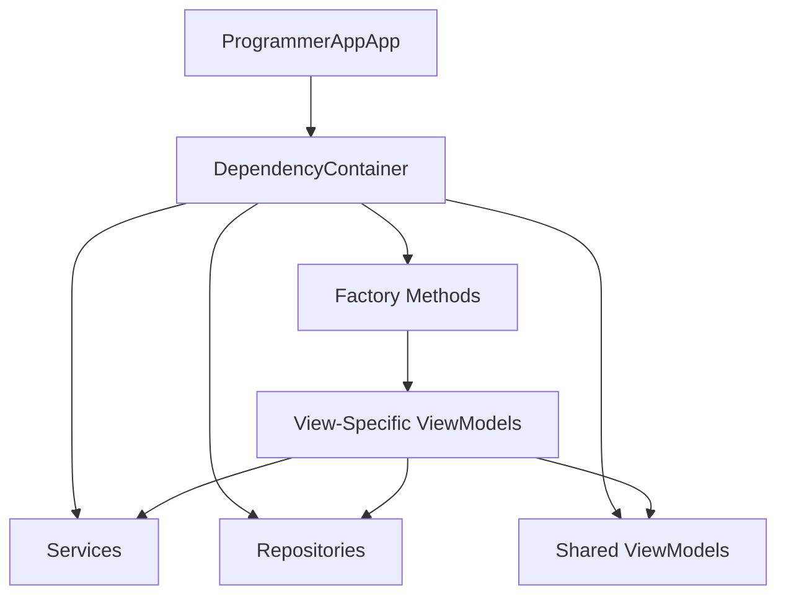
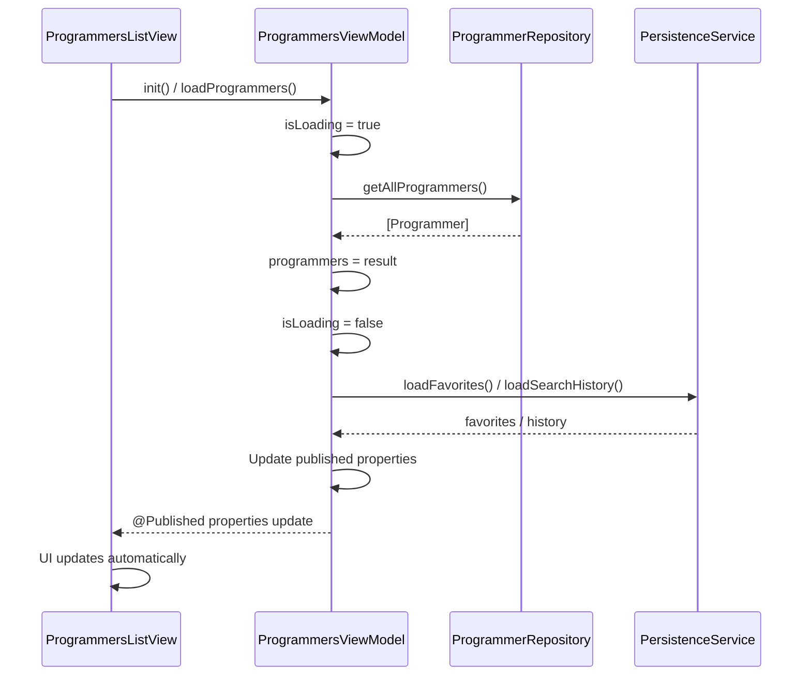
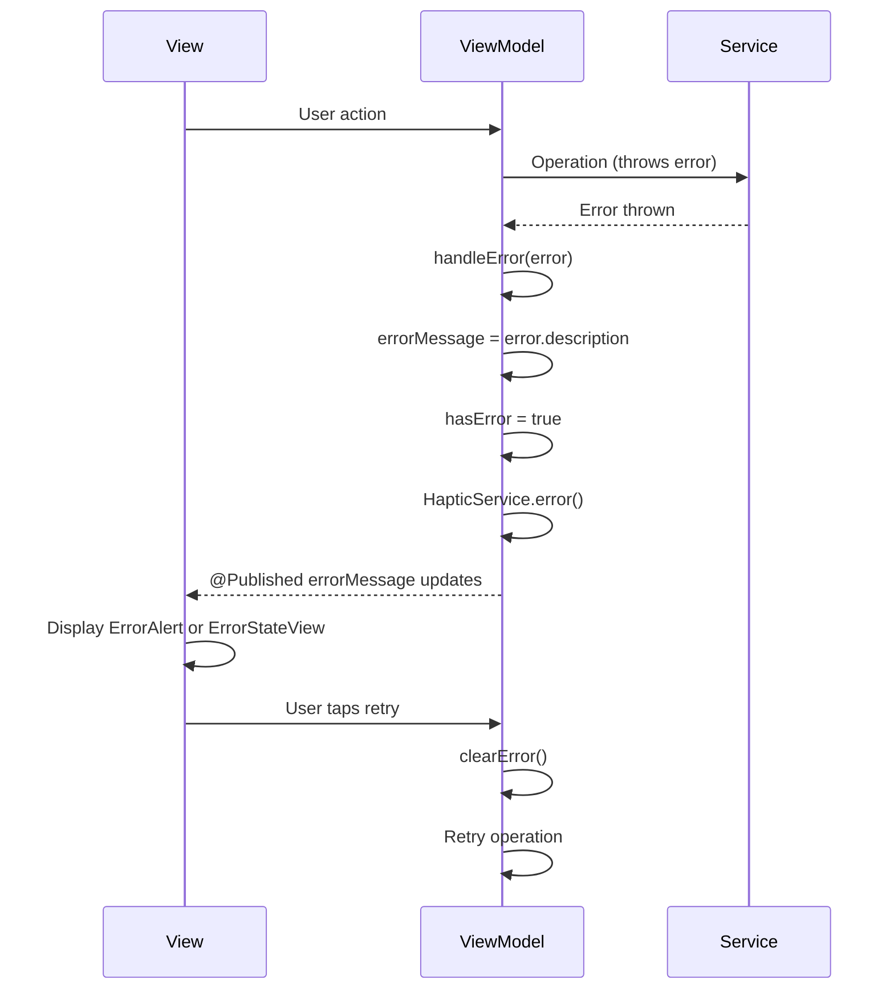

# ProgrammerApp Architecture

## Overview

ProgrammerApp follows the **MVVM (Model-View-ViewModel)** architecture pattern, providing a clean separation of concerns and making the codebase maintainable, testable, and scalable.

## Architecture Pattern

### MVVM Layers

```
┌─────────────────────────────────────────┐
│              Views (SwiftUI)            │
│  - Display UI                           │
│  - Handle user interactions             │
│  - Observe ViewModels                   │
└─────────────────┬───────────────────────┘
                  │ @ObservedObject
                  │ @StateObject
                  │ @EnvironmentObject
┌─────────────────▼───────────────────────┐
│           ViewModels                     │
│  - Business logic                       │
│  - State management                     │
│  - Data transformation                  │
└─────────────────┬───────────────────────┘
                  │ Uses
┌─────────────────▼───────────────────────┐
│         Services & Repositories          │
│  - Data access                           │
│  - Business services                     │
│  - Cross-cutting concerns                │
└─────────────────┬───────────────────────┘
                  │ Uses
┌─────────────────▼───────────────────────┐
│              Models                      │
│  - Data structures                      │
│  - Domain entities                      │
└─────────────────────────────────────────┘
```

## Layer Descriptions

### Models Layer

The Models layer contains pure data structures representing domain entities.

**Key Models:**
- `Programmer`: Represents a famous programmer with biography and facts
- `Topic`: Programming topic with code examples and explanations
- `Video`: Video tutorial with metadata
- `Quiz`: Quiz questions and answers
- `CodeChallenge`: Programming challenge with hints and solutions
- `Achievement`: Gamification achievement
- `AppError`: Error types for error handling
- `AppSettings`: User preferences and settings

**Characteristics:**
- Value types (structs) where possible
- Identifiable for SwiftUI list rendering
- Codable for persistence
- No business logic

### Views Layer

SwiftUI views organized by feature, responsible for UI presentation and user interaction.

**View Organization:**
```
Views/
├── ProgrammersListView.swift      # Main programmers list
├── ProgrammerDetailView.swift      # Programmer biography detail
├── ProgrammerCardView.swift        # Programmer card component
├── TopicsListView.swift            # Topics grid view
├── TopicDetailView.swift           # Topic detail with code examples
├── VideosListView.swift            # Video list
├── VideoWebView.swift              # Video player
├── QuizView.swift                  # Quiz interface
├── CodeChallengeView.swift         # Code challenge interface
├── StatisticsView.swift            # Statistics dashboard
├── AchievementsView.swift          # Achievements list
├── ExtrasView.swift                # Extras hub
├── ProfileView.swift               # User profile and settings
└── MainTabView.swift               # Tab navigation container
```

**View Responsibilities:**
- Display data from ViewModels
- Handle user input
- Trigger ViewModel actions
- Display loading and error states
- Navigate between screens

### ViewModels Layer

Observable objects that manage view state and business logic.

**ViewModel Organization:**
```
ViewModels/
├── ProgrammersViewModel.swift     # Programmers list state
├── TopicsViewModel.swift           # Topics state
├── VideosViewModel.swift           # Videos state
├── QuizViewModel.swift             # Quiz state and logic
├── CodeChallengeViewModel.swift    # Code challenge state
├── StatisticsViewModel.swift      # Statistics aggregation
├── GamificationViewModel.swift    # Gamification logic
└── TabCoordinator.swift            # Tab navigation state
```

**ViewModel Responsibilities:**
- Manage `@Published` properties for view binding
- Handle business logic
- Coordinate with services and repositories
- Transform data for views
- Handle errors and loading states

**State Management:**
- `@Published var`: Properties that trigger view updates
- `@Published var errorMessage: String?`: Error state
- `@Published var hasError: Bool`: Error flag
- `@Published var isLoading: Bool`: Loading state

### Services Layer

Services handle cross-cutting concerns and business logic.

**Services:**
- **PersistenceService**: Data persistence using UserDefaults
  - Handles encoding/decoding
  - Throws errors for proper error handling
  - Supports Codable types and primitives

- **StatisticsService**: Tracks user progress
  - Quiz scores
  - Study time
  - Streaks
  - Achievement calculations

- **HapticService**: Provides haptic feedback
  - Impact feedback (light, medium, heavy)
  - Notification feedback (success, warning, error)
  - Selection feedback

- **ImageCacheService**: Manages image caching
  - In-memory cache (NSCache)
  - Disk cache
  - Async image loading

- **DependencyContainer**: Dependency injection
  - Singleton container
  - Factory methods for ViewModels
  - Shared service instances

### Repositories Layer

Protocol-based data access layer that abstracts data sources.

**Repositories:**
- `ProgrammerRepositoryProtocol` / `ProgrammerRepository`
- `TopicRepositoryProtocol` / `TopicRepository`
- `VideoRepositoryProtocol` / `VideoRepository`
- `QuizRepositoryProtocol` / `QuizRepository`
- `CodeChallengeRepositoryProtocol` / `CodeChallengeRepository`

**Repository Pattern Benefits:**
- Easy to swap data sources (local → API)
- Testable with mock implementations
- Clear separation of data access logic

## Dependency Injection

The app uses a `DependencyContainer` singleton for dependency injection.

### Dependency Flow



### DependencyContainer Structure

```swift
@MainActor
class DependencyContainer: ObservableObject {
    // Services
    let persistenceService: PersistenceServiceProtocol
    let hapticService: HapticService
    let imageCacheService: ImageCacheService
    
    // Repositories
    let programmerRepository: ProgrammerRepositoryProtocol
    let topicRepository: TopicRepositoryProtocol
    // ... other repositories
    
    // Shared ViewModels
    let gamificationViewModel: GamificationViewModel
    let topicsViewModel: TopicsViewModel
    let statisticsViewModel: StatisticsViewModel
    
    // Factory methods for view-specific ViewModels
    func makeProgrammersViewModel() -> ProgrammersViewModel
    func makeVideosViewModel() -> VideosViewModel
    // ... other factory methods
}
```

## Data Flow

### Typical Data Flow Example: Loading Programmers



### Error Handling Flow



## State Management

### Property Wrappers

- **`@StateObject`**: For view-owned ViewModels
  ```swift
  @StateObject private var viewModel = DependencyContainer.shared.makeProgrammersViewModel()
  ```

- **`@ObservedObject`**: For ViewModels passed from parent
  ```swift
  @ObservedObject var viewModel: QuizViewModel
  ```

- **`@EnvironmentObject`**: For shared ViewModels
  ```swift
  @EnvironmentObject var statisticsViewModel: StatisticsViewModel
  ```

- **`@Published`**: In ViewModels for reactive updates
  ```swift
  @Published var programmers: [Programmer] = []
  @Published var isLoading: Bool = false
  ```

### State Updates

ViewModels update `@Published` properties, which automatically trigger SwiftUI view updates. This reactive pattern ensures the UI stays in sync with the data.

## Error Handling Architecture

### Error Types

The app uses `AppError` enum for consistent error handling:

```swift
enum AppError: LocalizedError {
    case persistenceError(String)
    case networkError(String)
    case decodingError(String)
    case encodingError(String)
    case invalidData(String)
    case notFound(String)
    case unknown(Error)
}
```

### Error Handling Strategy

1. **Services throw errors**: Services use `throws` for operations that can fail
2. **ViewModels catch and handle**: ViewModels catch errors and update error state
3. **Views display errors**: Views show error alerts or error state views
4. **User can retry**: Error states provide retry mechanisms

### Error Components

- **ErrorAlert**: SwiftUI alert modifier for displaying errors
- **ErrorStateView**: Full-screen error view with retry button
- **Error handling in ViewModels**: `handleError()` method standardizes error processing

## Navigation Structure

### Tab Navigation

The app uses a `TabView` with 5 main tabs:

1. **Programmers** (Tab 0)
2. **Topics** (Tab 1)
3. **Videos** (Tab 2)
4. **Extras** (Tab 3)
5. **Profile** (Tab 4)

### Navigation Stack

Each tab uses `NavigationStack` for hierarchical navigation:

```
MainTabView
├── ProgrammersListView
│   └── ProgrammerDetailView
│       └── WikipediaWebView
├── TopicsListView
│   └── TopicDetailView
│       └── CodeSnippetView
├── VideosListView
│   └── VideoWebView
├── ExtrasView
│   ├── QuizView (sheet)
│   ├── CodeChallengeView (sheet)
│   └── AchievementsView (sheet)
└── ProfileView
    └── StatisticsView (sheet)
```

### Tab Coordination

`TabCoordinator` manages tab selection and cross-tab navigation (e.g., navigating to Videos tab with a specific category).

## Theme System

The app uses a centralized theme system (`AppTheme`) for consistent styling.

### Theme Structure

```swift
struct AppTheme {
    struct Colors { ... }        // Color palette
    struct Gradients { ... }     // Gradient definitions
    struct Typography { ... }    // Font styles
    struct Spacing { ... }       // Spacing constants
    struct CornerRadius { ... }  // Corner radius values
    struct Shadows { ... }       // Shadow definitions
    struct Animations { ... }    // Animation presets
}
```

### Usage

Views reference theme constants for consistent styling:

```swift
Text("Hello")
    .font(AppTheme.Typography.title)
    .foregroundColor(AppTheme.Colors.primaryText)
    .padding(AppTheme.Spacing.lg)
```

## Component Architecture

### Reusable Components

The app includes reusable UI components in the `Components/` directory:

- **ErrorAlert**: Error alert modifier
- **ErrorStateView**: Full-screen error state
- **EmptyStateView**: Empty state display
- **LoadingView**: Loading indicators
- **SkeletonView**: Skeleton loading states
- **SearchBarView**: Search input with history
- **HeaderView**: Consistent header component
- **GradientBackground**: App background gradient
- **CardStyle**: Card styling modifier

### Component Benefits

- Consistency across the app
- Reduced code duplication
- Easier maintenance
- Centralized styling

## Testing Considerations

The architecture supports testing through:

1. **Protocol-based design**: Services and repositories use protocols for mocking
2. **Dependency injection**: Easy to inject test doubles
3. **Separation of concerns**: Each layer can be tested independently
4. **ViewModels are testable**: Business logic separated from UI

## Performance Optimizations

1. **Debounced search**: 300ms debounce for search input
2. **Lazy loading**: `LazyVStack` and `LazyVGrid` for large lists
3. **Image caching**: In-memory and disk caching for images
4. **Skeleton loading**: Better perceived performance
5. **Async operations**: Non-blocking data loading

## Future Enhancements

The architecture supports future enhancements:

- **API integration**: Repository pattern allows easy API integration
- **Core Data**: Can replace UserDefaults with Core Data
- **Offline support**: Architecture supports offline-first design
- **Real-time updates**: Combine framework ready for reactive updates
- **Modularization**: Clear boundaries support feature modules
